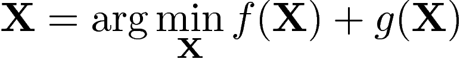
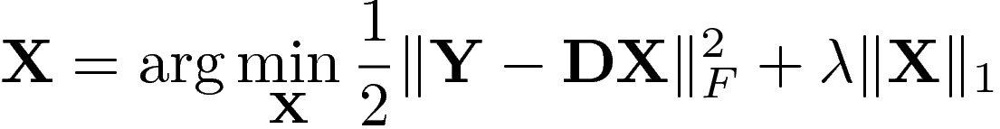
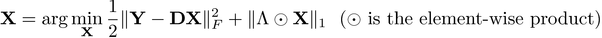
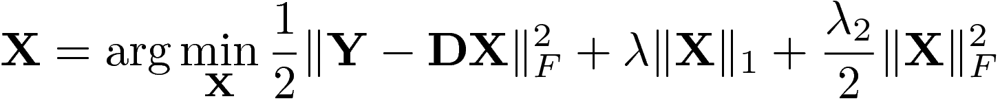
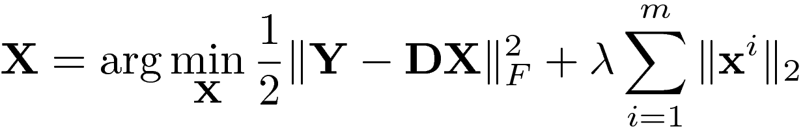
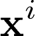

# Update 11/06/17: FISTA with backtracking is tested with lasso, lasso_weighted, and Elastic net.

# A simple implementation of [FISTA](https://github.com/tiepvupsu/FISTA)
**A MATLAB FISTA implementation based on the paper:**

A. Beck and M. Teboulle,  "A fast iterative shrinkage-thresholding algorithm for linear inverse problems", *SIAM Journal on Imaging Sciences*,
vol. 2, no. 1, pp. 183–202, 2009. [View the paper](http://people.rennes.inria.fr/Cedric.Herzet/Cedric.Herzet/Sparse_Seminar/Entrees/2012/11/12_A_Fast_Iterative_Shrinkage-Thresholding_Algorithmfor_Linear_Inverse_Problems_(A._Beck,_M._Teboulle)_files/Breck_2009.pdf).

**[Tiep Vu](http://www.personal.psu.edu/thv102/), Penn State, Sep 2016**

If you find any issue, please let me know via [this](https://github.com/tiepvupsu/FISTA/issues). I would really appreciate. Thank you.

***Note:*** Results in this repo are compared with those obtained by the [*SPAMS*](http://spams-devel.gforge.inria.fr/) toolbox. You need to install spams and put the generated 'build' folder under the 'spams' folder of this repo. 


# Table of content

<!-- MarkdownTOC -->

- [General Optimization problem](#general-optimization-problem)
- [Algorithms](#algorithms)
    - [If `L(f)` is easy to calculate,](#if-lf-is-easy-to-calculate)
    - [In case `L(f)` is hard to find,](#in-case-lf-is-hard-to-find)
- [Usage](#usage)
    - [`fista_general.m`](#fistageneralm)
    - [`fista_backtracking`](#fistabacktracking)
- [Examples](#examples)
    - [Lasso \(and weighted\) problems](#lasso-and-weighted-problems)
    - [Elastic net problems](#elastic-net-problems)
    - [Row sparsity problems](#row-sparsity-problems)
    - [Group sparsity problems \(implement later\)](#group-sparsity-problems-implement-later)

<!-- /MarkdownTOC -->


<a name="general-optimization-problem"></a>
## General Optimization problem

                

where: 

- `g: R^n -> R`: a continuous convex function which is possibly _nonsmooth_. 
+ `f: R^n -> R`: a smooth convex function of the type `C^{1, 1}`, i.e., continuously differentiable with Lipschitz continuous gradient `L(f)`:
`||grad_f(x) - grad_f(y)|| <= L(f)||x - y||` for every `x, y \in R^n`

***Note***: this implementation also work on nonnegativity constrained problems.

<a name="algorithms"></a>
## Algorithms

<a name="if-lf-is-easy-to-calculate"></a>
### If `L(f)` is easy to calculate,
We use the following algorithm:

where `pL(y)` is a proximal function defined as:


For a new problem, our job is to implement two functions: `grad_f(x)` and `pL(y)` which are often simpler than the original optimization stated in (1).

<a name="in-case-lf-is-hard-to-find"></a>
### In case `L(f)` is hard to find,
We can alternatively use the following algorithm: 


where `QL(x, y)` is defined as:


<a name="usage"></a>
## Usage
<a name="fistageneralm"></a>
### `fista_general.m`

`[X, iter, min_cost] = fista_general(grad, proj, Xinit, L, opts, calc_F) `

See [`fista_general.m`](https://github.com/tiepvupsu/FISTA/blob/master/fista_general.m).

where:
```matlab
    INPUT:
        grad   : a function calculating gradient of f(X) given X.
        proj   : a function calculating pL(x) -- projection
        Xinit  : a matrix -- initial guess.
        L      : a scalar the Lipschitz constant of the gradient of f(X).
        opts   : a struct
            opts.lambda  : a regularization parameter, can be either a scalar or
                            a weighted matrix.
            opts.max_iter: maximum iterations of the algorithm. 
                            Default 300.
            opts.tol     : a tolerance, the algorithm will stop if difference 
                            between two successive X is smaller than this value. 
                            Default 1e-8.
            opts.verbose : showing F(X) after each iteration or not. 
                            Default false. 
        calc_F: optional, a function calculating value of F at X 
                via feval(calc_F, X). 
   OUTPUT:
       X        : solution
       iter     : number of run iterations
       min_cost : the achieved cost
```
<a name="fistabacktracking"></a>
### `fista_backtracking`

`function X = fista_backtracking(calc_f, grad, Xinit, opts, calc_F)`

See [`fista_backtracking.m`](https://github.com/tiepvupsu/FISTA/blob/master/fista_backtracking.m)
where: 
```matlab
 INPUT:
      calc_f  : a function calculating f(x) in F(x) = f(x) + g(x) 
      grad   : a function calculating gradient of f(X) given X.
      Xinit  : a matrix -- initial guess.
      opts   : a struct
          opts.lambda  : a regularization parameter, can be either a scalar or
                          a weighted matrix.
          opts.max_iter: maximum iterations of the algorithm. 
                          Default 300.
          opts.tol     : a tolerance, the algorithm will stop if difference 
                          between two successive X is smaller than this value. 
                          Default 1e-8.
          opts.verbose : showing F(X) after each iteration or not. 
                          Default false. 
          opts.L0 : a positive scalar. 
          opts.eta: (must be > 1). eta in the algorithm (page 194)

      calc_F: optional, a function calculating value of F at X 
              via feval(calc_F, X). 
 OUTPUT:
     X        : solution
```


<a name="examples"></a>
## Examples

<a name="lasso-and-weighted-problems"></a>
### Lasso (and weighted) problems

***Optimization problem:***
This function solves the l1 Lasso problem: 

 

if `lambda` is a scalar, or :



if `lambda` is a matrix. In case `lambda` is a vector, it will be converted to a matrix with same columns and its # of columns = # of columns of `X`.

***MATLAB function:***

```matlab
function X = lasso_fista(Y, D, Xinit, opts)
    opts = initOpts(opts);
    lambda = opts.lambda;
    if numel(Xinit) == 0
        Xinit = zeros(size(D,2), size(Y,2));
    end
    %% cost f
    function cost = calc_f(X)
        cost = 1/2 *normF2(Y - D*X);
    end 
    %% cost function 
    function cost = calc_F(X)
        if numel(lambda) == 1 % scalar 
            cost = calc_f(X) + lambda*norm1(X);
        elseif numel(lambda) == numel(X)
            cost = calc_f(X) + norm1(lambda.*X);
        end
    end 
    %% gradient
    DtD = D'*D;
    DtY = D'*Y;
    function res = grad(X) 
        res = DtD*X - DtY;
    end 
    %% Checking gradient 
    if nargin == 0 && opts.check_grad
        check_grad(@calc_f, @grad, Xinit);
    end 
    %% Lipschitz constant 
    L = max(eig(DtD));
    %% Use fista 
    [X, ~, ~] = fista_general(@grad, @proj_l1, Xinit, L, opts, @calc_F);
end 
```

(See [])

***Example:***

**1. L1 minimization** (`lambda` is a scalar)

See [`demo_lasso.m`](https://github.com/tiepvupsu/FISTA/blob/master/demo_lasso.m)

```matlab
function test_lasso()
    clc
    d      = 300;   % data dimension
    N      = 70;    % number of samples 
    k      = 100;   % dictionary size 
    lambda = 0.01;
    Y      = normc(rand(d, N));
    D      = normc(rand(d, k));
    %% cost function 
    function c = calc_F(X)
        c = 0.5*normF2(Y - D*X) + lambda*norm1(X);
    end
    %% fista solution 
    opts.pos    = true;   % change to false for unconstrained problems
    opts.lambda = lambda;
    X_fista     = lasso_fista(Y, D, [], opts);
    %% spams solution 
    param.lambda     = lambda;
    param.lambda2    = 0;
    param.numThreads = 1;
    param.mode       = 2;
    param.pos        = opts.pos;
    X_spams          = mexLasso(Y, D, param);
    %% compare costs 
    cost_spams = calc_F(X_spams);
    cost_fista = calc_F(X_fista);
    fprintf('cost_fista = %.5s\n', cost_fista);
    fprintf('cost_spams = %.5s\n', cost_spams);
end
```


will generate an output like this:

```
cost_fista = 8.39552e+00
cost_spams = 8.39552e+00
```

**2. Weighted l1 minimization** (`lambda` is a vector or a matrix)

See [`demo_lasso_weighted.m`](https://github.com/tiepvupsu/FISTA/blob/master/demo_lasso_weighted.m)

**3. Full test**

Run [`fista_lasso_fulltest.m`](https://github.com/tiepvupsu/FISTA/blob/master/demo/fulltest_fista_lasso.m) to see the full test.

Results should look like this:

```
A toy example:
Data dimension                : 300
No. of samples                : 70
No. of atoms in the dictionary: 100
=====================================================
Lasso FISTA solution vs SPAMS solution,
 both of the following values should be close to 0.
1. average(norm1(X_fista - X_spams)) = 0.000028
2. costfista - cost_spams            = 0.000003
SPAMS provides a better cost.
=====================================================
Lasso Weighted FISTA solution vs SPAMS solution,
 both of the following values should be close to 0.
1. average(norm1(X_fista - X_spams)) = 0.000015
2. costfista - cost_spams            = -0.000004
FISTA provides a better cost.
================Positive Constraint===================
Lasso FISTA solution vs SPAMS solution,
 both of the following values should be close to 0.
1. average(norm1(X_fista - X_spams)) = 0.000025
2. costfista - cost_spams            = 0.003537
SPAMS provides a better cost.
================Positive Constraint===================
Lasso Weighted FISTA solution vs SPAMS solution,
 both of the following values should be close to 0.
1. average(norm1(X_fista - X_spams)) = 0.000016
2. costfista - cost_spams            = -0.000005
FISTA provides a better cost.
```


<a name="elastic-net-problems"></a>
### Elastic net problems 


***Optimization problem:***
This function solves the [Elastic Net](https://web.stanford.edu/~hastie/Papers/B67.2%20(2005)%20301-320%20Zou%20&%20Hastie.pdf) problem: 

 

if `lambda` is a scalar, or :


if `lambda` is a matrix. In case `lambda` is a vector, it will be convert to a matrix with same columns and its # of columns = # of columns of `X`.

***MATLAB function:***

See [`fista_enet.m`](https://github.com/tiepvupsu/FISTA/blob/master/fista_enet.m)

```matlab
function X = fista_enet(Y, D, Xinit, opts)
    opts    = initOpts(opts);
    lambda  = opts.lambda;
    lambda2 = opts.lambda2;

    if numel(lambda) > 1 && size(lambda, 2)  == 1
        lambda = repmat(opts.lambda, 1, size(Y, 2));
    end
    if numel(Xinit) == 0
        Xinit = zeros(size(D,2), size(Y,2));
    end
    %% cost f
    function cost = calc_f(X)
        cost = 1/2 *normF2(Y - D*X) + lambda2/2*normF2(X);
    end 
    %% cost function 
    function cost = calc_F(X)
        if numel(lambda) == 1 % scalar 
            cost = calc_f(X) + lambda*norm1(X);
        elseif numel(lambda) == numel(X)
            cost = calc_f(X) + norm1(lambda.*X);
        end
    end 
    %% gradient
    DtD = D'*D + lambda2*eye(size(D, 2));
    DtY = D'*Y;
    function res = grad(X) 
        res = DtD*X - DtY;
    end 
    %% Checking gradient 
    if opts.check_grad
        check_grad(@calc_f, @grad, Xinit);
    end 
    %% Lipschitz constant 
    L = max(eig(DtD));
    %% Use fista 
    opts.max_iter = 500;
    [X, ~, ~] = fista_general(@grad, @proj_l1, Xinit, L, opts, @calc_F);
end 
```

***Example:***

See [`demo_enet.m`](https://github.com/tiepvupsu/FISTA/blob/master/demo_enet.m)

<a name="row-sparsity-problems"></a>
### Row sparsity problems 

***Optimization problem:***



where 'm' is number of rows and  is the i-th row of .

***Matlab function:***

```matlab
function X = fista_row_sparsity(Y, D, Xinit, opts)
    opts = initOpts(opts);
    lambda = opts.lambda;

    if numel(lambda) > 1 && size(lambda, 2)  == 1
        lambda = repmat(opts.lambda, 1, size(Y, 2));
    end
    if numel(Xinit) == 0
        Xinit = zeros(size(D,2), size(Y,2));
    end
    %% cost f
    function cost = calc_f(X)
        cost = 1/2 *normF2(Y - D*X);
    end 
    %% cost function 
    function cost = calc_F(X)
        cost = calc_f(X) + lambda*norm12(X);
    end 
    %% gradient
    DtD = D'*D;
    DtY = D'*Y;
    function res = grad(X) 
        res = DtD*X - DtY;
    end 
    %% Checking gradient 
    if opts.check_grad
        check_grad(@calc_f, @grad, Xinit);
    end 
    %% Lipschitz constant 
    L = max(eig(DtD));
    %% Use fista 
    opts.max_iter = 500;
    [X, ~, ~] = fista_general(@grad, @proj_l12, Xinit, L, opts, @calc_F);   
```

***Example:***

```matlab
function test_row_sparsity()
    clc
    d      = 30;    % data dimension
    N      = 70;    % number of samples 
    k      = 50;    % dictionary size 
    lambda = 0.01;
    Y      = normc(rand(d, N));
    D      = normc(rand(d, k));
    %% cost function 
    function c = calc_F(X)
        c = 0.5*normF2(Y - D*X) + lambda*norm12(X);
    end
    %% fista solution 
    opts.pos = true;
    opts.lambda = lambda;
    opts.check_grad = 0;
    X_fista = fista_row_sparsity(Y, D, [], opts);
    cost_fista = calc_F(X_fista);
    fprintf('cost_fista = %.5s\n', cost_fista);
end
```

<a name="group-sparsity-problems-implement-later"></a>
### Group sparsity problems (implement later)
